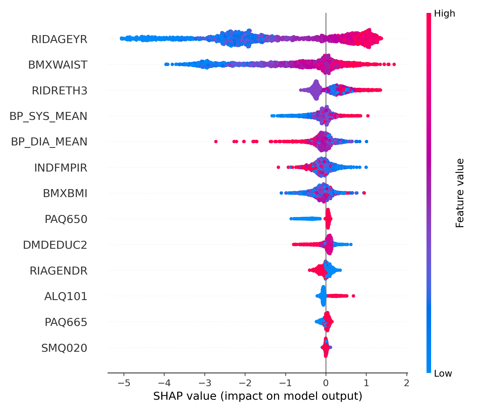

# NHANES Diabetes Risk Predictor

End-to-end diabetes risk modeling on NHANES (2011–2018) using a **non-lab** feature set by default (demographics + anthropometrics + blood pressure + questionnaire). An optional `--with-labs` flag includes HbA1c (lab-enhanced model).

This repo includes:
- Reproducible data loading (cached NHANES downloads with XPT validation)
- Train script that saves a complete pipeline artifact
- Evaluation script that reports metrics, group fairness metrics, and SHAP explainability

## Results (example run)

From `python src/evaluate.py` on the saved holdout split (non-lab, weighted):

- AUROC: **0.8504**
- AUPRC: **0.3087**
- Brier: **0.1250**

Fairness diagnostics (selection rate, TPR, FPR) are printed by sex (`RIAGENDR`) and race/ethnicity (`RIDRETH3`) at a configurable threshold (default 0.5).

SHAP summary (example):



## Quick start

### Windows (PowerShell)

```powershell
python -m venv venv
venv\Scripts\Activate.ps1

venv\Scripts\python -m pip install -r requirements.txt

# Train (non-lab default)
venv\Scripts\python src\model.py

# Train with labs (HbA1c)
venv\Scripts\python src\model.py --with-labs

# Evaluate saved model (metrics + fairness + SHAP)
venv\Scripts\python src\evaluate.py
```

### macOS / Linux

```bash
python3 -m venv venv
source venv/bin/activate

python -m pip install -r requirements.txt

python src/model.py
python src/model.py --with-labs
python src/evaluate.py
```

## What data is used and how it is stored

- NHANES cycles: 2011–2012 (G), 2013–2014 (H), 2015–2016 (I), 2017–2018 (J)
- Components (non-lab): `DEMO`, `DIQ`, `BMX`, `BPX`, `SMQ`, `ALQ`, `PAQ` (optional labs: `GHB` for HbA1c)
- Cached raw XPTs are stored under `data/cache/<cycle-years>/<component>_<suffix>.XPT`

The downloader validates the XPT header to avoid caching HTML error pages (NHANES URLs sometimes return an HTML "Page Not Found" while still returning HTTP 200).

## Outputs

Training (`python src/model.py`) writes:
- `artifacts/model.joblib` - full scikit-learn pipeline (preprocessing + XGBoost)
- `artifacts/split_indices.npz` - train/test indices for deterministic evaluation
- `artifacts/metadata.json` - run metadata (cycles, target, AUROC, etc.)

Evaluation (`python src/evaluate.py`) writes:
- `reports/shap_summary.png` - SHAP summary plot (top drivers across the test set)

## Method notes

- Target label: `DIQ010` (doctor told you have diabetes): 1=Yes, 2=No (other values dropped).
- Survey weights: uses `WTMEC2YR/4` when pooling four 2-year cycles.
- Metrics: AUROC + AUPRC + Brier (weighted). Fairness metrics reported by sex and race/ethnicity.

## Project structure

```
src/
  data_loader.py       # Fetch/load NHANES (cached)
  preprocessing.py     # Target + feature engineering + preprocessing
  model.py             # Train XGBoost + save artifacts
  evaluate.py          # Metrics + fairness + SHAP + plot

notebooks/
  01_eda.ipynb
  02_baseline.ipynb
```
